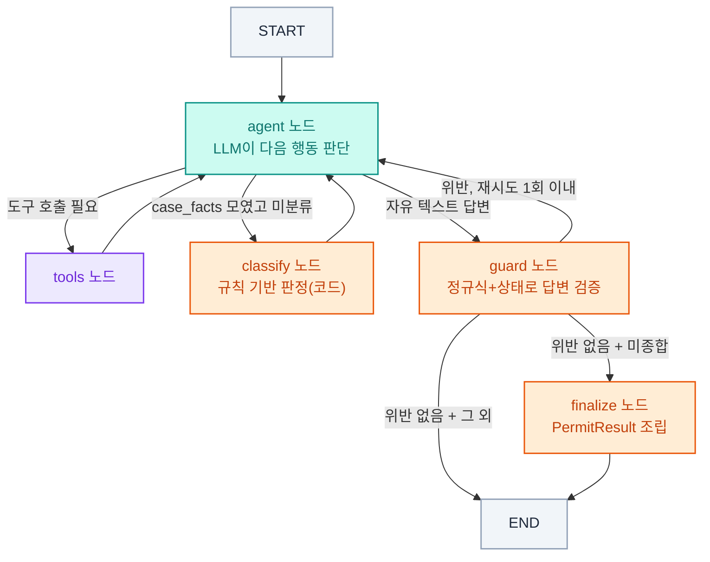

# 🏢 창업 로드맵 어시스턴트


> 허가/신고 여부처럼 법령상 객관적 기준으로 정해지는 판정은 LLM에게 맡기지 않는다.
> **코드가 결정론적으로 계산**하고, LLM은 그 결과를 검색된 근거로 설명만 한다.

서울시 카페ᆞ음식점 등 소규모 창업의 전체 여정을 안내하는 AI 어시스턴트입니다.
건축 인허가(신축ᆞ증축ᆞ용도변경ᆞ대수선 등) 판정에서 시작해, 공사(착공신고ᆞ사용승인)ᆞ
식품위생 영업신고ᆞ소방시설ᆞ간판ᆞ사업자등록ᆞ위생교육ᆞ오픈 준비까지 창업 전 과정을
하나의 로드맵으로 안내합니다.

## 배경

LLM에게 "이 경우 허가 대상인가 신고 대상인가"를 그대로 물어보면, 같은 입력에도 매번
다른 결론을 내는 문제를 실제로 겪었다. 법령상 임계값(면적ᆞ층수ᆞ시설군 등)으로 정해지는
판정은 재현 가능해야 하므로, 이 프로젝트는 **판정(rule)** 과 **설명(LLM)** 의 경계를
명확히 나눈다:

- 판정: `classify_case`ᆞ`classify_food_business`ᆞ`classify_fire_safety`ᆞ`classify_signage`
  — 파이썬 규칙 함수가 계산. 몇 번을 물어도 같은 입력이면 같은 결과.
- 설명: LangGraph 에이전트가 검색된 법령 근거로 판정 결과를 자연어로 풀어서 안내.

## 특징

- **6종 규칙 기반 판정**: 건축 허가/신고/기재변경(`classify_case`), 식품위생 영업신고
  종류(`classify_food_business`), 소방시설 설치 대상(`classify_fire_safety`), 간판ᆞ
  옥외광고물 허가/신고(`classify_signage`) — 전부 면적ᆞ층수ᆞ시설군 등 법령상 객관적
  기준으로 코드가 계산하고, LLM은 그 결과를 설명만 함. 부분 정보로 이미 결론이 나면
  나머지 필드를 더 묻지 않도록 단락평가(short-circuit)로 최적화
- **부지 정보 자동 조회**: 주소만 알면 용도지역(VWorld), 건폐율ᆞ용적률 법정 상한(정적
  표), 기존 건물의 건축물대장 표제부(공공데이터포털 건축HUB)까지 API로 자동 조회.
  건축물대장은 도로명ᆞ지번 주소 둘 다 지원(VWorld 역지오코딩)하며, VWorld 장애 시
  지번 주소만 지원하는 전국 법정동표 매칭으로 자동 폴백
- **통합 창업 로드맵(Step 0~4)**: 건축 트랙(행위유형 확인→인허가→공사)은 실제 순서가
  있는 절차라 순차로, 창업 준비 트랙(식품위생ᆞ소방ᆞ간판ᆞ사업자등록ᆞ위생교육)은
  인허가와 무관하게 병렬로 안내. 판정으로 확인된 사실(체크 불가)과 사용자가 직접
  완료를 밝힌 항목(체크박스)을 구분 표시하고, 실제로 앞 절차가 끝나야 가능한 항목
  (예: 식품위생 신고는 사용승인 후, 소방ᆞ간판 설치는 공사 완료 후)은 🔒로 잠금
- **답변 신뢰성 가드(`guard_node`)**: LLM이 자유 텍스트로 답을 끝내려 할 때 정규식+
  상태로 결정론적으로 검증 - 근거 없는 법령 인용, 판정 전 단계 안내, 한 턴에 여러
  단계 몰아주기, 기록 누락 등을 잡아 재시도를 유도(프롬프트 지시만으로는 못 막는
  사례들을 실사용 중 발견해 도입)
- **정확한 법령 인용**: 법/시행령/시행규칙/조례 계층 태그를 매겨 상충 시 상위 법령
  우선 원칙 적용. 벡터 검색 후 CrossEncoder 리랭커로 재정렬해 관련도 높은 근거만
  LLM에 전달, 법령 구조 인식 청킹(본문/부칙/별표 구분)으로 별표 표 데이터가 가짜
  조항으로 섞이는 것 방지
- **대화 상태 영구 저장**: LangGraph 체크포인터를 SQLite로 저장해 서버 재시작 후에도
  세션이 유지됨
- **LLM 폴백**: Gemini 무료 티어 할당량 소진 시 Cerebras로 자동 전환
- **증분 인덱싱**: 문서 변경분만 해시 비교 후 재임베딩 (전체 재인덱싱 불필요)
- **테스트 스위트**: 핵심 판정 로직(6종 규칙 엔진)ᆞ대화 상태 가드ᆞ로드맵 잠금 규칙을
  pytest로 회귀 검증(LLM 호출 없이 결정론적으로 실행)
- **웹 채팅 UI**: 브라우저에서 바로 사용 가능 (`/ui`) - 로드맵 패널ᆞ법령 원문 카드ᆞ
  재접속 진행 현황 요약 포함

## 아키텍처

`agent`와 `tools` 두 노드가 도구가 더 필요 없다고 판단할 때까지 서로를 오가는
ReAct 패턴이되, 판정ᆞ종합ᆞ검증 세 지점은 LLM이 아니라 그래프가 강제로 실행하는
결정론적 노드(`classify`ᆞ`finalize`ᆞ`guard`)로 분리했다.



- **classify**: `classify_case` 등 규칙 함수가 허가/신고/기재변경을 판정 — 법령상
  객관적 기준으로 정해지는 값을 LLM 재량에 맡기지 않기 위함
- **finalize**: classify가 확정한 판정 결과 + LLM이 채운 필수서류ᆞ관계기관 + 최종
  답변 텍스트를 모아 `PermitResult`로 조립. 한 번 종합되면 잠겨서 이후 무관한 대화가
  덮어쓰지 못함
- **guard**: 자유 텍스트로 끝나는 모든 답변을 정규식+상태로 검증(근거 없는 법령
  인용, 판정 전 단계 안내, 한 턴에 여러 단계 몰아주기 등) — 프롬프트 지시만으로는
  못 막는다는 게 실사용 중 재현돼서 도입

## 창업 로드맵 구조

| Step | 내용 | 트랙 |
|---|---|---|
| 0 | 행위 유형 확인(신축ᆞ증축ᆞ용도변경 등) | 건축(순차) |
| 1 | 건축 인허가 판정(허가/신고/기재변경) + 필수 서류ᆞ사전 진단ᆞ예상 소요 기간 | 건축(순차) |
| 2 | 공사(착공신고ᆞ설계ᆞ공사감리ᆞ시공ᆞ인테리어ᆞ장비설치ᆞ사용승인) | 건축(순차) |
| 3 | 식품위생 영업신고ᆞ소방시설ᆞ간판ᆞ옥외광고물ᆞ사업자등록ᆞ위생교육 | 창업 준비(병렬) |
| 4 | 직원 등록(4대보험)ᆞ영업 시작 | 창업 준비(병렬) |

개발 진행 이력ᆞ현재 알려진 한계ᆞ다음 우선순위는 [`docs/phase1_roadmap.md`](docs/phase1_roadmap.md) 참고.
그 외 문서는 어느 걸 봐야 하는지 [`docs/README.md`](docs/README.md)에 정리해뒀다.

## 에이전트 구성 (`src/agents/`)

역할별 도구 모음으로 나눠져 있고, 아직 별도 서브그래프/오케스트레이터 없이 `agent.py`의
단일 ReAct 루프가 이 모듈들을 도구로 바인딩해 쓰는 구조입니다.

| 모듈 | 역할 |
|---|---|
| `site.py` | 용도지역ᆞ건폐율ᆞ용적률ᆞ건축물대장 자동 조회(API) |
| `permit.py` | 허가/신고/기재변경 판정(규칙 기반) + 절차 로드맵 |
| `food_safety.py` | 식품위생법상 영업 종류 판정(규칙 기반) |
| `fire_safety.py` | 소방시설 설치 대상 판정(규칙 기반) |
| `signage.py` | 간판ᆞ옥외광고물 허가/신고 판정(규칙 기반) |
| `construction.py` | 착공ᆞ설계ᆞ공사감리ᆞ사용승인 안내(정적/RAG 콘텐츠) |
| `business_registration.py` | 사업자등록 안내 |
| `hygiene_education.py` | 위생교육 안내 |
| `opening_checklist.py` | 오픈 준비(인테리어ᆞ직원등록ᆞ영업시작) 체크리스트 |
| `roadmap_progress.py` | 사용자가 실제로 완료했다고 밝힌 항목 자기보고 추적 |
| `legal_data.py` | 법정 임계값(`permit_thresholds.yaml`) 로더 |

## 기술 스택

| 영역 | 선택 | 이유 |
|---|---|---|
| 판정 로직 | 파이썬 규칙 함수 (LLM 아님) | 법령 임계값 계산은 재현 가능해야 함 — LLM에 맡겼더니 같은 입력도 매번 다르게 계산하는 문제를 실제로 겪음 |
| LLM | Google Gemini(`gemini-3.1-flash-lite`, 기본) → Cerebras(할당량 소진 시 자동 폴백) | 무료 할당량이 가장 큰 모델을 기본으로 쓰고, 소진 시 자동 전환 |
| 임베딩 | HuggingFace `intfloat/multilingual-e5-base` (로컬 CPU 추론) | 한국어/영어 혼용 법령 문서에 대응하는 다국어 임베딩 |
| 검색 정확도 | CrossEncoder 재랭킹(`reranker.py`) | 벡터 검색으로 넉넉히 후보를 뽑은 뒤 재정렬해 관련도 높은 근거만 LLM에 전달 |
| 벡터DB | ChromaDB (`chroma_db/`, 로컬 영구 저장) | 별도 서버 없이 로컬 영구 저장이 가능해 소규모 배포에 적합 |
| 증분 인덱싱 | LangChain `SQLRecordManager` | 콘텐츠 해시 기반으로 변경분만 재임베딩, 전체 재인덱싱 불필요 |
| 에이전트 | LangGraph(ReAct 패턴) + `SqliteSaver` 체크포인터 | 조건 분기(판정/종합/검증)를 명시적 그래프로 표현 + 대화 상태 영구 저장 |
| 부지 자동조회 | VWorld API(용도지역ᆞ지오코딩), 공공데이터포털 건축HUB(건축물대장) | 주소만으로 용도지역ᆞ기존 건물 정보를 자동 조회해 사용자 입력 최소화 |
| API / UI | FastAPI + 정적 HTML/JS 채팅 UI | REST API + 웹 채팅 UI를 하나의 서버로 서빙 |
| 배포 | Docker (`Dockerfile`) | 임베딩/리랭커 모델(~2.3GB) + 벡터DB를 빌드 시점에 이미지에 구워 컨테이너 시작을 빠르게 함 |
| 테스트 | pytest (파이썬 로직) + Node.js subprocess(프론트 로드맵 잠금 로직 검증) | 핵심 로직은 결정론적이라 LLM 호출 없이 회귀 검증 가능 |

## 프로젝트 구조

```
permit-assistant/
├── src/                     # 소스 코드
│   ├── config.py            # 환경 설정
│   ├── agent.py              # LangGraph 에이전트 조립 진입점(ReAct 루프)
│   ├── graph.py               # LangGraph 그래프 배선(노드/엣지 연결, agent.py에서 분리)
│   ├── routing.py             # 그래프 조건 분기 결정 함수(route_after_*)
│   ├── classify.py            # 판정 도메인 분류 파이프라인
│   ├── guard.py                # 답변 신뢰성 사후 검증(guard_node)
│   ├── prompts.py              # 시스템 프롬프트 조립
│   ├── roadmap.py              # 건축 트랙(Step 0→1→2) 순차 진행 상태 추적
│   ├── roadmap_steps.py        # 로드맵 Step0~4 하위단계 판정 테이블(챗봇/API 공유)
│   ├── message_utils.py        # 메시지 content → 순수 텍스트 추출 공용 유틸
│   ├── project_status.py       # 로드맵 진행 현황(진행률ᆞ트랙별 다음 할 일) 단일 계산 소스
│   ├── pipeline.py             # CLI 인터페이스
│   ├── api.py                  # FastAPI 서버
│   ├── evaluate.py             # 응답 품질 평가
│   ├── agents/                 # 역할별 에이전트 도구 모음(위 "에이전트 구성" 표 참고)
│   ├── rag/                    # 검색 파이프라인
│   │   ├── ingestion.py         # 문서 로딩 + 청킹
│   │   ├── law_chunker.py       # 법령 조항 단위 청킹 (본문/부칙/별표 구역 분리)
│   │   ├── parent_store.py      # 조항 원문 저장소 (부모-자식 청킹의 부모)
│   │   ├── retriever.py         # 벡터 검색 + 증분 인덱싱
│   │   ├── reranker.py          # 검색 결과 CrossEncoder 재랭킹
│   │   └── regulation.py        # 법령ᆞ조례 검색 도구(에이전트에 바인딩)
│   └── static/                  # 웹 채팅 UI (/ui)
├── data/
│   ├── laws/                # 법령(건축법ᆞ식품위생법ᆞ소방시설법ᆞ옥외광고물법 등)
│   ├── ordinances/          # 서울시 조례
│   └── procedures/          # 인허가 절차 문서
├── docs/                    # 로드맵, 사례ᆞ테스트 시나리오 문서
├── tests/                   # pytest 스위트(규칙 엔진ᆞguard_nodeᆞ로드맵 잠금)
├── chroma_db/                # ChromaDB + 인덱싱 해시 기록 (gitignore)
├── Dockerfile                # 컨테이너 이미지 빌드 (모델+벡터DB 포함)
├── pyproject.toml
└── README.md
```

## 시작하기

### 1. 패키지 설치 ([uv](https://docs.astral.sh/uv/) 사용)

```bash
uv sync
# 테스트를 돌리려면 dev 의존성도 함께 설치
uv sync --extra dev
```

### 2. 환경 변수 설정

```bash
cp .env.example .env
```

`.env`에 다음 값을 입력:
- `GEMINI_API_KEY` (필수) — [발급](https://aistudio.google.com/apikey)
- `CEREBRAS_API_KEY` / `CEREBRAS_MODEL` (선택) — Gemini 무료 티어 할당량(하루 20회) 소진 시 자동 폴백용
- `VWORLD_API_KEY` / `VWORLD_DOMAIN` (선택) — [발급](https://www.vworld.kr/dev/v4api.do), 주소 기반 용도지역ᆞ건축물대장 조회용. 운영키는 VWorld 콘솔에 등록한 서비스URL과 일치하는 `VWORLD_DOMAIN`이 필수(서버사이드 호출은 Referer로 판별 안 됨). 없으면 사용자에게 직접 물어보는 것으로 대체됨
- `ARCHHUB_SERVICE_KEY` (선택) — [발급](https://www.data.go.kr) (국토교통부_건축물대장정보 서비스 활용신청), 기존 건물 건축물대장 자동 조회용. 없으면 지번 주소 기준 전국 법정동표 매칭으로 자동 폴백, 그마저 없으면 사용자에게 직접 물어보는 것으로 대체됨

### 3. 데이터 준비

`data/` 폴더에 관련 자료 배치 (지원 포맷: pdf, md, txt, html, hwp):
- `laws/`: 건축법ᆞ식품위생법ᆞ소방시설법ᆞ옥외광고물법 등 법률/시행령/시행규칙
- `ordinances/`: 서울시 건축조례, 도시계획조례, 옥외광고물 조례
- `procedures/`: 인허가 절차 안내 문서

법령 원문 PDF에 별표(첨부 표)가 이미지로 박혀 텍스트 추출이 안 되는 경우,
국가법령정보센터에서 해당 별표만 한글(hwp) 파일로 따로 받아 같은 폴더에
넣으면 자동으로 인덱싱된다(내부적으로 `hwp5html`로 표까지 변환).

### 4. 인덱싱

```bash
# 최초 인덱싱 (또는 완전히 새로 구축하고 싶을 때)
uv run python -m src.pipeline --ingest --reset

# 이후 데이터 추가/수정 시 (안 바뀐 문서는 재임베딩 스킵)
uv run python -m src.pipeline --ingest
```

### 5. 사용

**CLI**
```bash
# 단발 질문
uv run python -m src.pipeline --query "강남구 30평 카페 창업 절차는?"

# 대화 모드
uv run python -m src.pipeline --interactive --user jena
```

**API 서버 + 웹 UI**
```bash
uv run uvicorn src.api:app --reload
```
- 웹 채팅 UI: http://localhost:8000/ui
- API 문서: http://localhost:8000/docs

**Docker**
```bash
docker build -t permit-assistant .
docker run -p 8000:8000 -e GEMINI_API_KEY=발급받은키 permit-assistant
```
빌드 시점에 벡터DB(임베딩 모델 ~2.3GB 포함)를 이미지 안에 미리 구축해, 컨테이너
시작 시 바로 서빙 가능한 상태가 됩니다.

**테스트**
```bash
uv run pytest
```

## 사용 예시

```
You: 강남구에 40평 카페 열려고 해. 기존 사무실 자리인데 뭐 준비해야 해?

Bot: 기존 사무실을 카페로 → 근린생활시설 내 용도변경 케이스네요.
     [Step 1-1: 상황 분석+필요 절차] 용도변경 신고 대상입니다 [출처: 건축법 제19조].
     다음으로 필수 서류를 안내해 드릴까요?

You: 응 알려줘

Bot: [Step 1-2: 필수 서류] 용도변경 신고서, 임대차계약서, ...
     이어서 사전 진단(주차ᆞ정화조ᆞ소방 등)도 확인해 드릴까요?

...(인허가 판정이 끝나면 공사 단계, 이어서 식품위생 영업신고ᆞ소방시설ᆞ
간판ᆞ사업자등록ᆞ위생교육까지 로드맵을 따라 순서대로/병렬로 계속 안내)
```

## 작성자

jenayang · KTB4 Bootcamp
